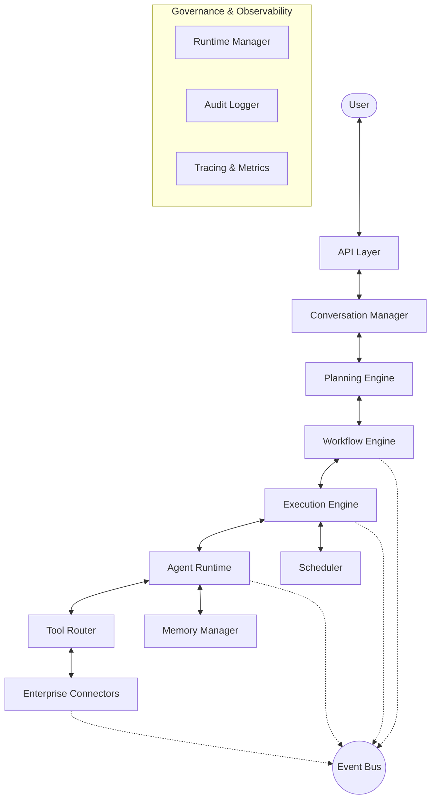
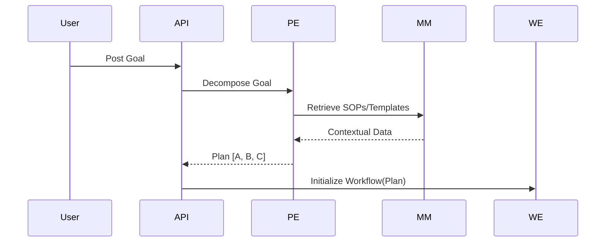
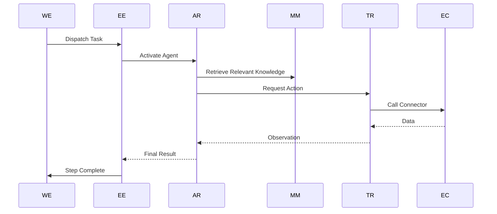

# Phase 6: Enterprise Runtime Architecture

## 1. Vision

The **Enterprise Runtime** is the operational core of Oracle69 AI Digital Office. It serves as the "Execution Engine for the AI Workforce," providing a robust, deterministic, and observable environment where multiple AI agents collaborate to fulfill complex organizational goals. By sitting between the planning layer and enterprise connectors, the runtime ensures that AI reasoning is safely translated into verifiable actions across the enterprise.

## 2. Runtime Architecture

The architecture follows a modular, event-driven pattern where every subsystem communicates through a central **Event Bus**. This design ensures high scalability, loose coupling, and perfect observability of the agent reasoning process.



---

## 3. Core Components

### Agent Runtime

An isolated execution context for a single agent. It manages the agent's internal loop (Reasoning -> Action -> Observation).

- **Responsibility**: State management, prompt assembly, model interaction.

### Execution Engine

The dispatcher that manages the lifecycle of individual tasks within a workflow.

- **Responsibility**: Task assignment, concurrency control, immediate retries.

### Planning Engine

The strategic brain that decomposes high-level goals into executable plans.

- **Responsibility**: Goal decomposition, agent selection, dependency mapping.

### Workflow Engine

The state machine for long-running, multi-step processes.

- **Responsibility**: State persistence, step transitions, DAG management.

### Scheduler

Handles time-triggered events and recurring tasks.

- **Responsibility**: Cron jobs, delayed execution, pollers.

### Tool Router

The secure bridge between agent actions and Phase 5 enterprise connectors.

- **Responsibility**: Action mapping, credential injection, parameter validation.

### Conversation Manager

Maintains the interaction state between users and the office.

- **Responsibility**: Thread management, session context.

### Context Manager

Dynamic prompt builder that hydrates agent templates with relevant data.

- **Responsibility**: RAG integration, system instruction management.

### Memory Manager

Unified interface for relational (Business), vector (Semantic), and activity (Execution) memory.

- **Responsibility**: Data persistence, knowledge retrieval.

### Runtime Manager

The global supervisor and resource allocator.

- **Responsibility**: Health checks, resource monitoring, system recovery.

### Event Bus Integration

The decoupled communication layer using a pub/sub model.

- **Responsibility**: Inter-module communication, real-time logging.

---

## 4. Execution Lifecycle

1.  **Request**: User sends a goal to the API.
2.  **Context**: **Conversation Manager** provides session history.
3.  **Plan**: **Planning Engine** generates a multi-agent execution plan.
4.  **Workflow**: **Workflow Engine** persists the plan as a stateful job.
5.  **Dispatch**: **Execution Engine** triggers the first task in the plan.
6.  **Act**: **Agent Runtime** executes reasoning and requests tools via **Tool Router**.
7.  **Persist**: **Memory Manager** archives findings and results.
8.  **Complete**: **Workflow Engine** marks the job as finished and notifies the API.

## 5. Agent Lifecycle

1.  **Register**: Agent metadata (role/tools) is loaded.
2.  **Init**: Runtime allocates resources for the agent instance.
3.  **Reason**: Agent processes context and determines next action.
4.  **Observe**: Agent receives feedback from tool execution or other agents.
5.  **Index**: Results are stored in semantic memory.
6.  **Release**: Resources are freed after completion or inactivity.

---

## 6. Planning Flow

Goals become executable tasks through recursive decomposition:

- **Goal**: "Onboard new hire John Doe."
- **Task 1**: `HR Agent` creates a Google Doc offer letter (Connector: Docs).
- **Task 2**: `Operations Agent` creates a Slack channel (Connector: Slack).
- **Task 3**: `IT Agent` sets up email (Connector: Gmail).

## 7. Workflow Model

- **Sequential**: A → B → C.
- **Parallel**: [A, B] → C.
- **Conditional**: If A succeeds, then B, else C.
- **Human Approval**: Pause and wait for `approval.received` event.

## 8. Tool Routing

Maps JSON action schemas to validated `Connector` calls:

- `Action: { tool: "drive.upload", params: { file: "..." } }`
- **Tool Router** fetches decrypter credentials and executes the Google Drive Connector.

## 9. Memory Integration

- **Short-term**: Local KV store for the current workflow step.
- **Long-term**: PgVector for semantic search across previous projects.
- **Business**: Prisma-backed relational tables for Tasks, Projects, and Users.

## 10. Event Flow

Uses a standardized event catalog:

- `workflow.started`: Initialization.
- `agent.thought.emitted`: Log of reasoning.
- `tool.execution.failed`: Trigger for retry/error logic.

---

## 11. Runtime APIs

- `POST /api/runtime/workflows`: Start a new execution.
- `GET /api/runtime/workflows/:id/trace`: Stream execution logs.
- `POST /api/runtime/approval/:id`: Sign-off on a pending task.

## 12. Internal Interfaces

- `IPlanner.plan(goal: string): Promise<Plan>`
- `IExecutor.execute(task: Task): Promise<Result>`
- `IToolRouter.route(request: ToolRequest): Promise<ToolResponse>`

---

## 13. Security & Observability

- **Isolation**: Each agent execution is sandboxed with organization-level scoping.
- **Authentication**: JWT validation for all runtime entry points.
- **Audit**: Every action is logged with a hash for integrity verification.
- **Tracing**: OpenTelemetry integration for cross-agent tracing.

---

## 14. Failure Recovery

- **Retries**: Configurable exponential backoff for connector failures.
- **Checkpoints**: Workflow state saved after every successful step.
- **DLQ**: Failed tasks are moved to a `Review` state for human intervention.

---

## 15. Package Structure

```
packages/runtime/
├── src/
│   ├── planner/        # Goal decomposition logic
│   ├── workflow/       # State machine management
│   ├── executor/       # Task dispatching
│   ├── agents/         # Isolated agent runtimes
│   ├── tools/          # Tool routing & connector bridging
│   └── events/         # Event bus integration
```

---

## 16. Sequence Diagrams

### User Request to Planning



### Execution Loop



---

## 17. Sprint Roadmap

### Sprint 6.1: Foundation & Registry

- **Objective**: Implement the `RuntimeManager` and `AgentRegistry` enhancement.
- **Deliverables**: Modular agent registration system; basic runtime scaffolding.
- **Success Criteria**: An agent can be initialized with department-specific metadata.

### Sprint 6.2: Strategic Planning Engine

- **Objective**: Develop the `PlanningEngine` for goal decomposition.
- **Deliverables**: Reasoning loop to break string goals into JSON task arrays.
- **Success Criteria**: 90% accuracy in mapping "Human Goals" to "Agent Tasks".

### Sprint 6.3: Stateful Workflow Engine

- **Objective**: Implement the `WorkflowEngine` with persistence.
- **Deliverables**: Prisma-backed state machine; resume/pause capabilities.
- **Success Criteria**: Workflows survive process restarts without data loss.

### Sprint 6.4: Tool Router & Secure Execution

- **Objective**: Bridge Agent Reasoning with Phase 5 Connectors.
- **Deliverables**: `ToolRouter` with credential injection.
- **Success Criteria**: Agent can perform a multi-step "Search -> Write -> Send" loop across different services.

### Sprint 6.5: Observability & Memory Loop

- **Objective**: Integrate `EventBus` and `MemoryManager` indexing.
- **Deliverables**: Real-time event tracing; automatic results-to-embeddings indexing.
- **Success Criteria**: Full traceability of agent "Thoughts" and automatic knowledge growth.

---

## 18. Architecture Review

### Potential Risks

- **Cascading Failures**: A failure in the Planner affects all subsequent steps.
- **Resource Exhaustion**: Large workflows exceeding memory limits.

### Scalability Concerns

- **Event Bus Throughput**: High event volume during peak execution.
- **PostgreSQL Connection Pooling**: Workflow persistence under high concurrency.

### Recommended Design Improvements

- **Fallback Models**: If `gemini-flash` fails to plan, automatically upgrade to `gemini-pro`.
- **Parallel Execution**: Allow non-dependent steps to run simultaneously.

---

## 19. Architecture Approval Checklist

- [ ] Does the architecture support multi-tenant isolation?
- [ ] Is every tool call recorded in the Audit Log?
- [ ] Can workflows survive a system crash via check-pointing?
- [ ] Are agent "Thoughts" exposed for debugging and monitoring?
- [ ] Is the Planning Engine decoupled from specific AI models?

---

## 20. Open Design Decisions

1. **Event Bus Implementation**: Should we use an internal EventEmitter for MVP or go straight to a persistent queue like BullMQ/Redis?
2. **Context Window Strategy**: How will we handle very long execution traces in the agent's prompt? (Summarization vs. Truncation).
3. **Rollback Strategy**: For tools without "Undo" capabilities (e.g., Slack messages), what is the standardized "Compensation" action?
