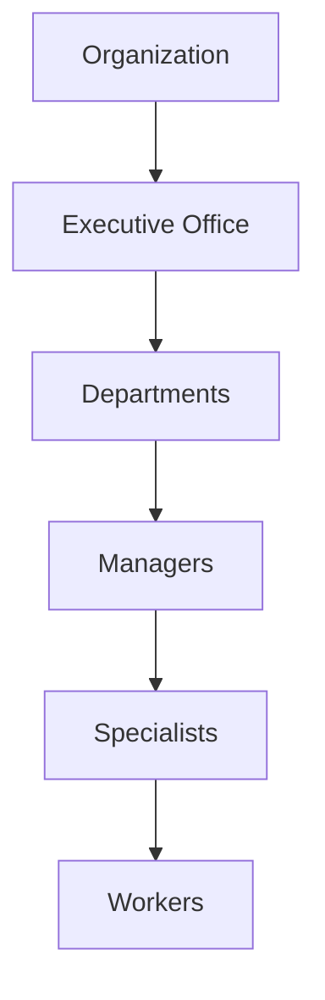
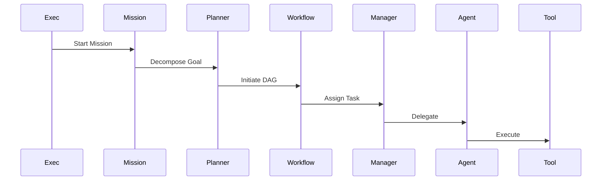

# Phase 7: Enterprise AI Workforce Architecture

## 1. Vision
The Enterprise AI Workforce transforms the Oracle69 AI Digital Office from a collection of agents into a structured, autonomous organization. It enables agents to act as "digital employees" who collaborate, specialize, delegate, and manage organizational missions, all while remaining tethered to the Enterprise Runtime (Phase 6) and Human-in-the-Loop oversight.

---

## 2. Architectural Principles
- **Autonomy**: Agents make decisions based on defined goals and capabilities.
- **Determinism**: Workflows are traceable and reproducible via the Runtime.
- **Observability**: Every communication and state change is audited.
- **Security**: Strict organization and department-level isolation.
- **Modularity**: Agents and departments can be added/updated without runtime changes.

---

## 3. Workforce Hierarchy
- **Organization**: The top-level entity (Root).
- **Executive Office**: Strategic leadership (CEO, CTO, etc.).
- **Departments**: Functional units (Finance, HR, Engineering).
- **Managers**: Task coordinators within departments.
- **Specialists/Workers**: Execution-level agents.

---

## 4. Executive AI
Executives define organizational mission, enforce compliance, and approve high-impact decisions.
- **CEO**: Goal setting, strategic prioritization.
- **COO**: Operational oversight, department coordination.
- **CFO**: Financial planning, expense approvals.
- **Legal Counsel**: Compliance enforcement, contract review.

---

## 5. Department Architecture
Each department operates as a semi-autonomous micro-organization with its own memory and agent pool.
- **Finance**: Budgeting, Invoicing, Procurement.
- **HR**: Hiring, Onboarding, Performance.
- **Engineering**: Code development, deployment.

---

## 6. Agent Taxonomy
- **Executives**: Strategic guidance.
- **Managers**: Execution planning and delegation.
- **Specialists**: High-complexity task execution (e.g., Coding, Data Analysis).
- **Workers**: Repetitive/Volume task execution.
- **Background Services**: Continuous maintenance tasks.

---

## 7. Agent Lifecycle
1. Registration (Metadata definition)
2. Activation (Runtime allocation)
3. Task Assignment (Mission reception)
4. Planning (DAG generation)
5. Execution (Reasoning-Action loop)
6. Communication (Collaboration)
7. Memory Update (Archiving)
8. Retirement (Resource reclamation)

---

## 8. Agent Communication Framework
- **Message Bus**: Global event-driven backbone.
- **Inbox/Outbox**: Per-agent persistent message queues.
- **Escalation**: Automatic protocol to trigger manager/executive intervention if tasks fail.

---

## 9. Delegation Model
1. **Request**: Manager requests task completion.
2. **Acceptance**: Specialist/Worker agent accepts responsibility.
3. **Delegation**: Manager provides context and specific goals.
4. **Monitoring**: Manager observes execution.
5. **Handoff**: Results are returned or escalated.

---

## 10. Mission Engine
Autonomous, multi-task business missions (e.g., "Customer Onboarding").
- **Mission Object**: Goal, priority, deadline, owner, DAG workflow, success metrics.

---

## 11. Human-in-the-Loop
- **Approval Gates**: Critical actions (e.g., spending, hiring) pause the mission until an executive approval event is received.

---

## 12. Enterprise Memory Usage
- **Working Memory**: Current workflow state.
- **Semantic Memory**: Knowledge retrieval from past missions.
- **Business Memory**: Relational records of organizational entities.

---

## 13. Runtime Integration
- Uses **Planning Engine** for mission decomposition.
- Uses **Workflow Engine** for stateful mission execution.
- Uses **Tool Router** for external API access.

---

## 14. Security Model
- **Isolation**: Agents restricted to their own department's namespace.
- **RBAC**: Tool/Memory access defined by agent role.

---

## 15. Event Catalog
- `agent.activated`
- `agent.assigned`
- `mission.started`
- `mission.completed`
- `approval.requested`
- `delegation.created`

---

## 16. Public APIs
- `GET /api/workforce/agents`
- `POST /api/workforce/missions`
- `GET /api/workforce/missions/:id`

---

## 17. Internal Interfaces
- `IAgentManager`
- `IDepartmentManager`
- `IMissionManager`
- `IExecutiveCoordinator`

---

## 18. Mermaid Diagrams

### Organization Hierarchy

### Mission Execution

---

## 19. Phase 7 Roadmap
- Sprint 7.1: Agent Taxonomy & Registration.
- Sprint 7.2: Communication Framework (Inbox/Outbox).
- Sprint 7.3: Delegation & Approval Engines.
- Sprint 7.4: Mission Engine implementation.
- Sprint 7.5: Executive Office & Compliance.

---

## 20. Risks
- **Conflict**: Multiple agents working on conflicting goals. *Mitigation*: Priority-based locking in the Runtime.
- **Resource Saturation**: Mission overloading. *Mitigation*: Quota management per department.

---

## 21. Definition of Done
- [ ] Workforce registry active.
- [ ] Agents can delegate tasks.
- [ ] Mission Engine successfully executes multi-department workflows.
- [ ] Human approval gates functioning.

---

### Architecture Approval Checklist
- [ ] Hierarchy clearly defined?
- [ ] Communication protocol event-driven?
- [ ] Security boundaries enforced?

### Open Design Decisions
1. **Global vs Local Memory**: Define exact scope of memory shared across departments.
2. **Conflict Resolution**: Logic for when two agents disagree on mission tactics.

### Implementation Readiness Assessment
**High**. The architecture is modular and aligns with Phase 6 Runtime capabilities.
